# 📚 Sebo do João — Sistema de Gestão de Acervo de Produtos

> **Projeto Interdisciplinar** desenvolvido para a digitalização de processos do Sebo do João, uma tradicional loja física de São José do Rio Preto (SP), com foco na organização de seu acervo de produtos.
---

## 🏪 Sobre o Sebo do João

O **Sebo do João** é uma loja tradicional da cidade de São José do Rio Preto (SP), especializada na compra e venda de itens culturais.

📍 **Endereço:** Rua Conselheiro Saraiva, 163 — Vila Ercília, São José do Rio Preto — SP, 15013-090

A loja possui um amplo acervo de produtos culturais, com destaque para:

- 📀 Discos de vinil (principal destaque do acervo)
- 📚 Livros
- 💿 CDs
- 📀 DVDs e Blu-rays
- 🖼️ HQs e Mangás
- 📻 Fitas cassete  

---

## 🎯 Objetivo do Projeto

O sistema tem como objetivo modelar e estruturar um ambiente de e-commerce voltado às necessidades de compra e venda da loja, promovendo sua inserção no meio digital. Além disso, busca organizar e otimizar os processos internos, facilitando a gestão de produtos e a realização das operações.

---

## 🧱 Estado Atual do Desenvolvimento

O projeto encontra-se na fase inicial de desenvolvimento, com foco em modelagem e estruturação do sistema.

Até o momento foram desenvolvidos:

- 📦 Entidades do sistema em **Java (pacote `model`)**
- 🧪 Instanciação e testes das classes na classe `Main`
- 🗄️ Modelagem conceitual do banco de dados através do **DER**
- 🧾 Criação das tabelas e inserção de dados (aproximadamente 10 inserts por tabela) em **SQL Server**
- 🎨 Protótipos das principais interfaces do sistema desenvolvidos no **Figma**

---

## 🧾 Diagramas do Sistema
Diagramas de modelagem do sistema:


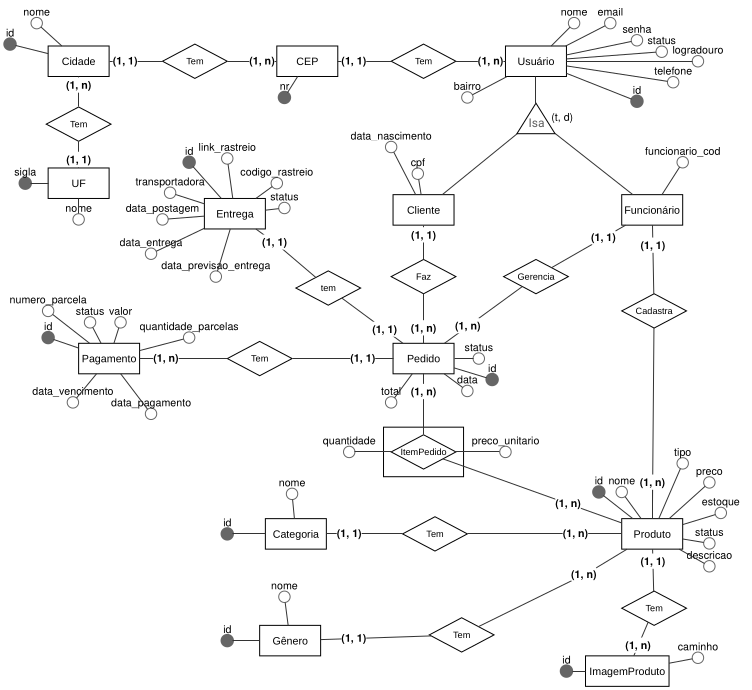

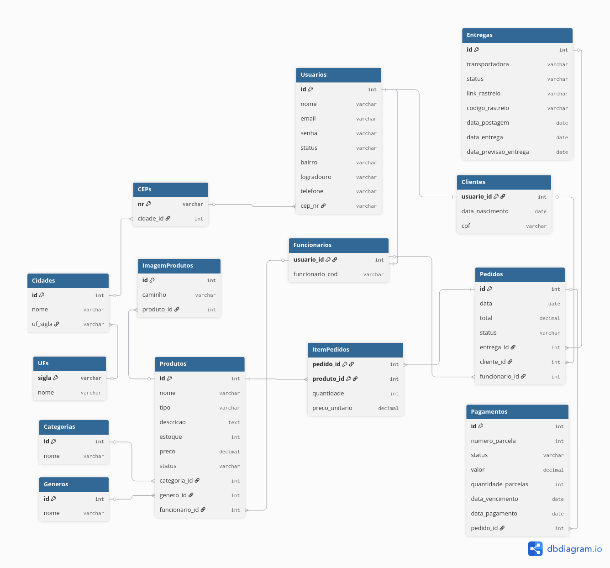

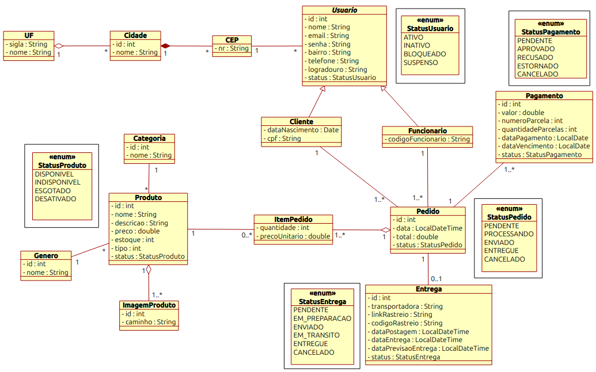

---

## 🖥️ Interfaces do Sistema

A seguir estão os protótipos das principais interfaces desenvolvidas para o sistema:


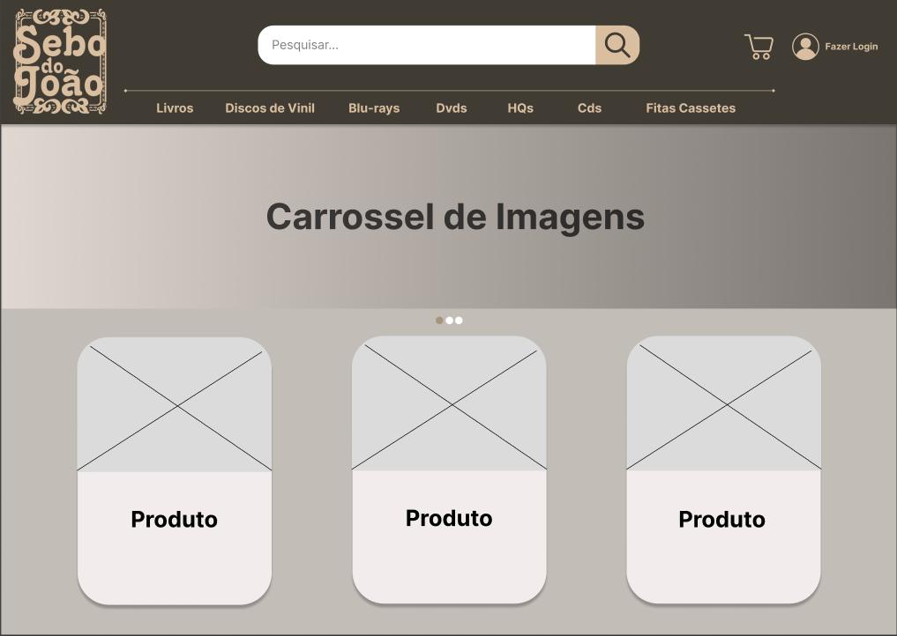
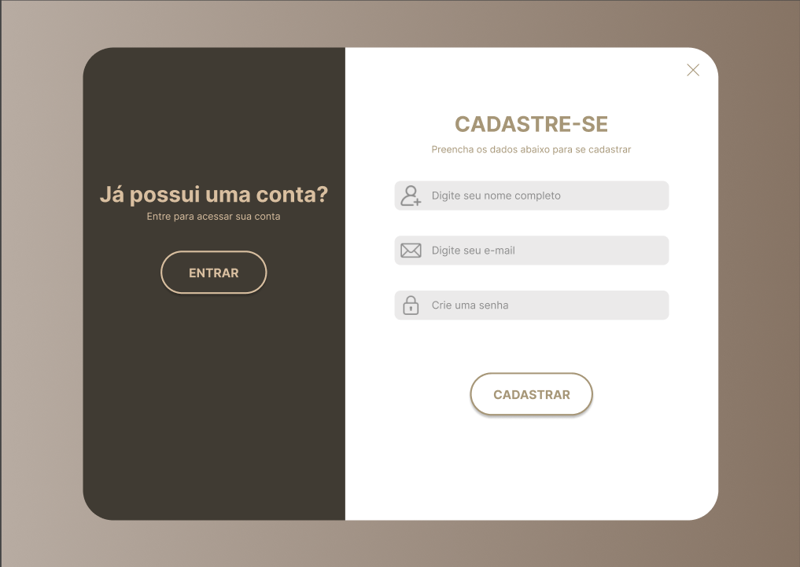
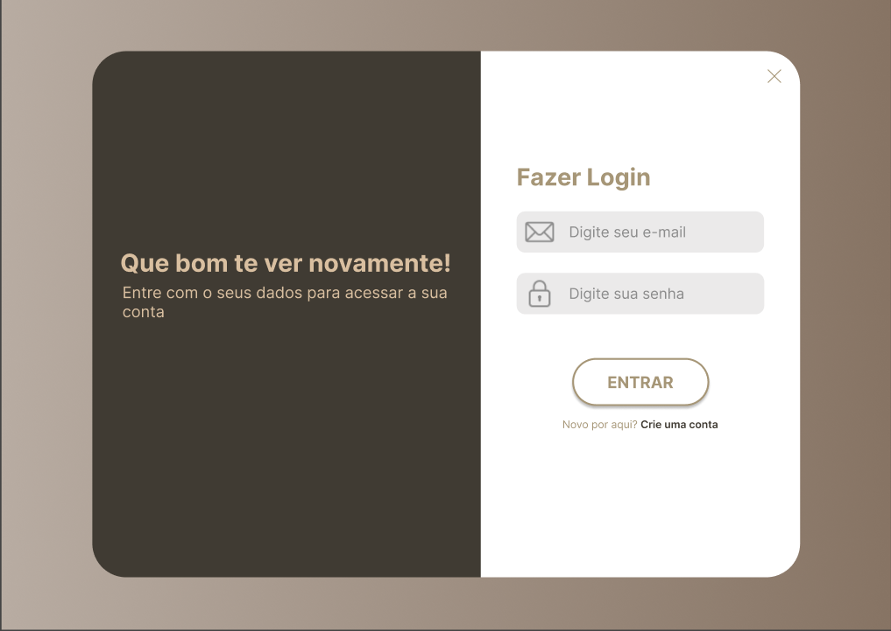
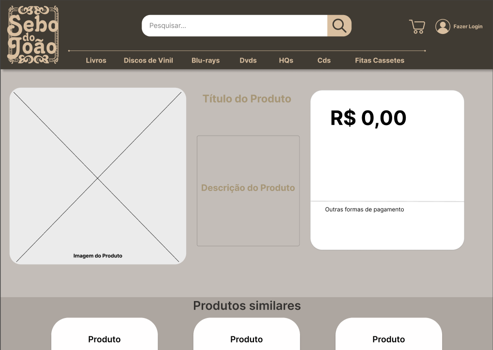
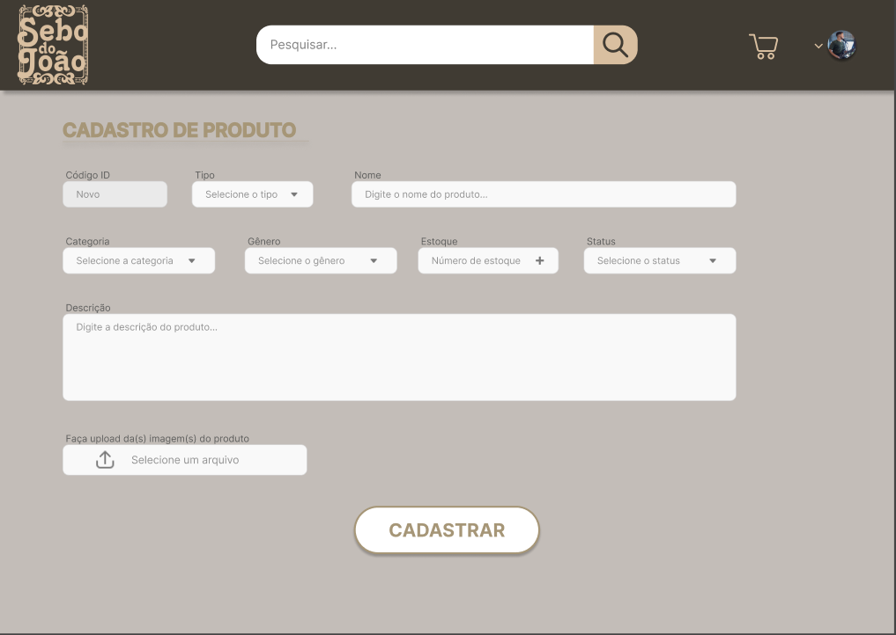
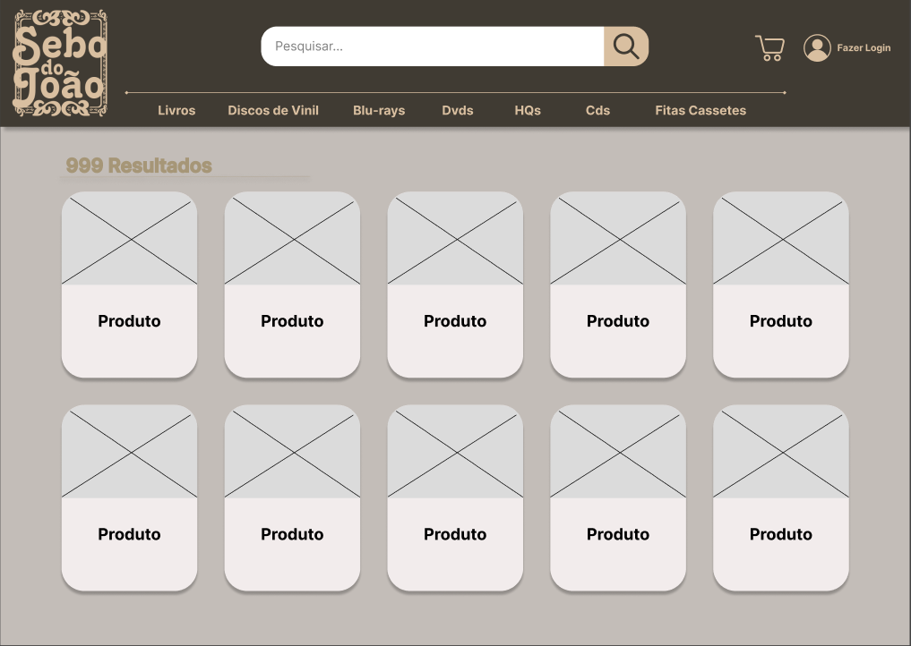
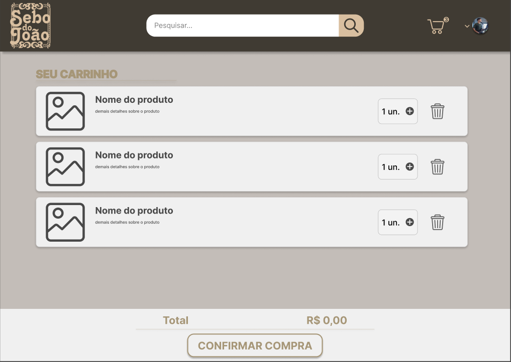
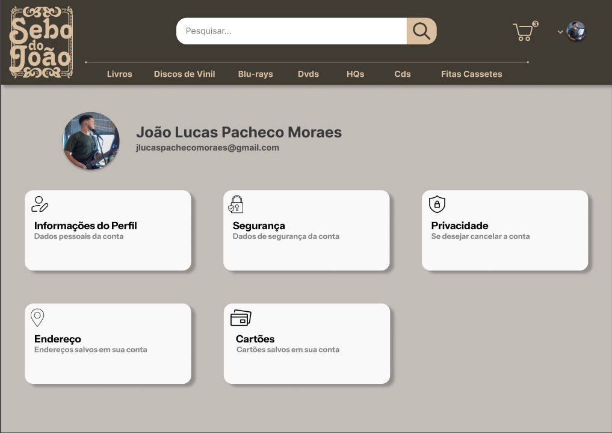
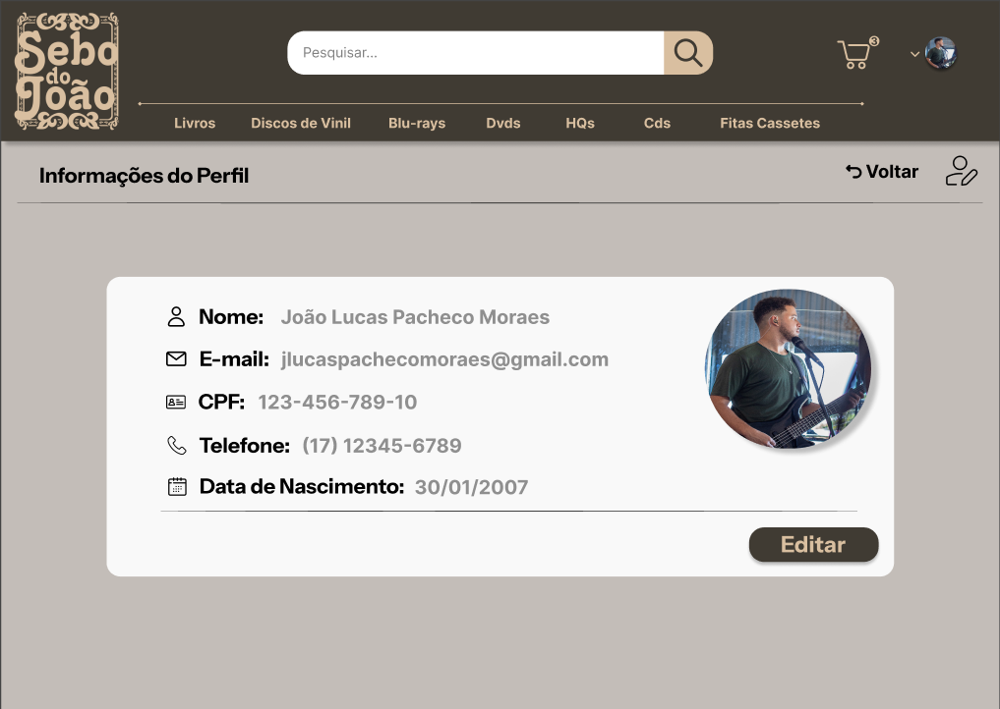

---

📁 Todos os documentos estão organizados na pasta `/docs` do repositório.

---

## 🛠️ Tecnologias Utilizadas

- ☕ Java — modelagem das entidades do sistema  
- 🗄️ SQL Server — banco de dados relacional  
- 📊 BrModelo — modelagem do DER  
- 🎨 Figma — prototipação das interfaces  

---

## 📁 Estrutura do Repositório

```text
sebo-do-joao/
├── docs/
│   ├── diagramas/
│   │   ├── DER-Sebo_do_Joao.png
│   │   ├── Diagrama_Banco_de_Dados.png
|   |   └── ...
│   ├── sql/
│   │   └── SeboDoJoao.sql
│   └── interfaces/
│       ├── Tela-principal-index.png
│       └── ...
|
├── java/
│   └── seboDoJoao/
│       └── src/
│           ├── app/
│           │   └── Main.java
│           └── model/
│               ├── Produto.java
│               ├── Cliente.java
│               └── ...
│
├── .gitignore
└── README.md
